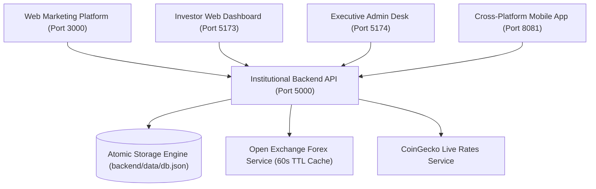

# Heron Assets Trustee — Complete Project & Conversation History
*Built and developed by Microbase.*

---

## 📋 Document Overview & AI Handover Protocol

> 🏛️ **MANDATORY INSTRUCTION FOR NEW AI AGENTS & DEVELOPERS**:
> This document is the **single source of truth** for the entire lifecycle, conversation record, technical architectural decisions, and feature evolutions of the **Heron Assets Trustee Institutional Ecosystem** since Day 1.
> 
> When taking over or continuing work on this project:
> 1. **Entity Name & Branding**: The official institution name is **Heron Assets Trustee**. The developer attribution is **Built and developed by Microbase** (placed in developer documentation, readmes, and implementation files — never cluttered across consumer UIs).
> 2. **Git Repository Rule**: The repository maintains **ONE single branch: `main`**. All previous branches (including `react-web-migration`) have been consolidated into `main`.
> 3. **Native Build Rule**: **DO NOT execute native Android/iOS build commands** (such as `./gradlew assembleRelease` or `eas build`) on this environment. Validate TypeScript and build correctness strictly using `npx tsc --noEmit` for `mobile/`, `npm run build` for `dashboard/`, `admin/`, and `backend/`.
> 4. **No Synthetic Fallbacks in Production**: All operations connect directly to the live backend REST API (`http://<LAN_IP>:5000` or `http://localhost:5000`). Demo accounts (`demo_123`, `demo_token`) and mock catches have been purged.

---

## 🏗️ System Architecture & Sub-Project Topology

The ecosystem consists of five decoupled, production-grade sub-projects:

| Sub-Project | Tech Stack | Port | Purpose / Functionality |
| :--- | :--- | :--- | :--- |
| **`backend/`** | Node.js, Express, TypeScript, JWT, bcryptjs | `5000` (LAN `0.0.0.0`) | Central REST API, dual KYC OCR/MRZ engine, live biometric motion validation, multi-currency conversion, user ledger. |
| **`mobile/`** | Expo SDK 57, React Native 0.86.3, React 19.2.3, TypeScript, Expo Camera | `8081` (Metro) | iOS & Android mobile application with real-time biometric motion scanner, portfolio management, wallet whitening, security centers. |
| **`dashboard/`** | React 19, Vite 6, Tailwind CSS, Recharts, Lucide Icons | `5173` | Web client portal for institutional investors (deposits, yield plans, withdrawals, OCR KYC portal). |
| **`admin/`** | React 19, Vite 6, Tailwind CSS, Lucide Icons | `5174` | Executive command center with full KYC Compliance Desk, Transaction KYC Hold release workflow, and User Management. |
| **`web/`** | React 19, Vite 6, Tailwind CSS, Lucide Icons | `3000` | High-converting cyber-luxury institutional landing platform and strategy portal. |

---

## 📜 Chronological Evolution & Conversation History

### Phase 1: Genesis & Institutional Core Architecture
- **Inception**: Created the institutional wealth and cryptocurrency asset trustee platform.
- **Backend Setup**: Initialized TypeScript Express server with modular architecture (`routes/`, `services/`, `middleware/`, `database/`).
- **Zero-Balance Financial Security**: Enforced that all registered accounts start with `$0.00` balances, requiring verified on-chain deposit approval.
- **Authentication & Security**: Built JWT Bearer authentication, dual-phase OTP security codes for registrations and withdrawals, and cryptographic audit loggers.

---

### Phase 2: Web Applications & Admin Desk
- **Web Marketing (`web/`)**: Built an institutional cyber-luxury landing page (`#070908` background, `#d4af37` gold accents, `#28d17c` emerald highlights) showcasing quantitative arbitrage, AI high-frequency trading, and sovereign yield strategies.
- **Investor Dashboard (`dashboard/`)**: Developed a modern single-page dashboard for verified investors featuring deposit pipelines, withdrawal OTP verification, portfolio analytics, and multi-tier affiliate management.
- **Admin Compliance Desk (`admin/`)**: Built an executive control desk for user account freezing/unfreezing, manual deposit credit authorization, transaction holds, and system yield parameters.

---

### Phase 3: Cross-Platform Mobile Application (`mobile/`)
- **Expo SDK 57 Upgrade**: Configured Expo SDK 57 with React Native 0.86.3 and React 19.
- **Brand Identity**: Designed animated falcon crest opening splash screens with smooth transitions into the main trading interface.
- **Dynamic LAN Auto-Discovery**: Implemented automatic network resolution so mobile devices on local WiFi connect seamlessly to the backend server without hardcoded URLs.

---

### Phase 4: Branding Transition & Repository Consolidation
- **Brand Evolution**: Transitioned entity branding from legacy *Heron Capital* to **Heron Assets Trustee**, with formal developer attribution to **Microbase** recorded in developer documentation.
- **Git Branch Consolidation**: Consolidated development branches (`react-web-migration`) into the single authoritative `main` branch and pruned redundant branches.

---

### Phase 5: Multi-Currency Live Forex Conversion Engine
- **Open Exchange Rates Service**: Connected `backend/src/services/marketData.ts` to `https://open.er-api.com/v6/latest/USD` with 60-second TTL caching.
- **Seamless Currency Selector**: Enabled instant switching across USD ($), EUR (€), GBP (£), JPY (¥), CAD (CA$), AUD (AU$), and CHF (CHF) across web and mobile without disruptive popup alerts.

---

### Phase 6: Document OCR & MRZ (ICAO 9303) Verification Pipeline
- **Backend OCR Parsing Engine**: Developed `backend/src/services/ocrEngine.ts` to extract Machine Readable Zone (MRZ) data from Passports (Type 3 2x44) and ID cards (Type 1 3x30) using 7-3-1 weighting checksum validation.
- **Discrepancy Matrix**: Admin compliance desk equipped with automated side-by-side mismatch detection comparing user claims against decoded document payloads.
- **Compliance Hold Workflow**: Enabled administrative transaction holds (`pending_kyc`) with instant release once KYC verification is approved.

---

### Phase 7: Biometric Liveness & Anti-Spoofing Evolution
- **Initial Static Uploads**: Started with static document and selfie uploads.
- **Directional Challenges (Head Turns & Hand Waves)**: Integrated dynamic multi-stage challenges (turn left, turn right, wave hand).
- **Lightweight Live Human Motion Engine (Latest Standard)**:
  - Streamlined the liveness pipeline to real-time optical movement and depth analysis.
  - Eliminated complex multi-step gestures in favor of natural live human motion detection.
  - **Threshold**: When real human movement is verified at **>=90% confidence**, the algorithm auto-submits the biometric capture for clearance.
  - **Privacy Guarantee**: Biometric session videos are held in encrypted ephemeral memory and **automatically deleted within 24 hours** (or immediately upon instant clearance approval).
  - Clear user-facing notices added on both web dashboard and mobile app.

---

### Phase 8: Critical Bug Fixes & Stability Hardening
1. **Mobile KYC Infinite Loop & Recapture Fix**:
   - *Problem*: Mobile scanner was continuously looping back, triggering fallbacks, and recapturing frames repeatedly.
   - *Root Cause*: Inline callback references passed to `LiveBiometricScanner` caused re-renders on state updates (such as motion confidence percentage updates), re-triggering the scanning `useEffect`.
   - *Fix*: Wrapped callbacks in stable `useRef` handles and added strict lifecycle flags (`isSessionRunningRef`, `isCompletedRef`) ensuring exactly one execution per modal launch.
2. **Dashboard HUD Cleanup**:
   - *Problem*: Residual hand wave icons and prompts remained in the web scanner.
   - *Fix*: Replaced directional overlays with the unified real-time live human motion oval guide and confidence telemetry HUD.
3. **Purge of Demo Accounts & Mock Fallbacks**:
   - Removed synthetic offline fallbacks across `mobile/src/services/api.ts` and `dashboard/src/services/api.ts` to ensure real server error propagation.

---

### Phase 9: Biometric Authentication (Face ID / Fingerprint) System
- **Hardware Integration (`mobile/src/services/biometrics.ts`)**:
  - Integrated `expo-local-authentication` (`~57.0.2`).
  - Added hardware sensing checks (`hasHardwareAsync()`, `isEnrolledAsync()`) supporting Face ID, Touch ID, Android BiometricPrompt, and Iris sensors.
- **Account & Security Center Toggle**:
  - Added a dedicated Biometric Authentication switch in the mobile Profile Modal (Security & Defense tab) with real-time hardware status tags (`✓ HARDWARE ENROLLED`, `⚠️ NOT ENROLLED IN OS`, `○ NO HARDWARE`).
  - Enforced a mandatory live biometric challenge upon enabling the toggle to verify sensor enrollment before committing the preference.
- **Quick Biometric Sign-In**:
  - Added one-tap "Quick Sign In with Biometrics" button on the mobile Login screen.
- **Backend Sync**:
  - Synchronized `biometricsEnabled` flag in `backend/src/routes/auth.ts`, `backend/src/services/db.ts`, and TypeScript definitions.

---

## 🔑 System Credentials & Default Configuration

| Role / Service | Username / Email | Password / Note | Access Level |
| :--- | :--- | :--- | :--- |
| **System Administrator** | `admin@heronassets.com` | `admin123` | Full Executive & Compliance Admin |
| **Live Investor** | `microbase300@gmail.com` | *(User Configured)* | Verified Investor Tier 2 |
| **Backend Port** | `0.0.0.0:5000` | Express REST API | Core Gateway |
| **Dashboard Port** | `localhost:5173` | React 19 + Vite | Investor Web Dashboard |
| **Admin Port** | `localhost:5174` | React 19 + Vite | Compliance Control Center |
| **Mobile Metro** | `localhost:8081` | Expo Metro Bundler | Mobile Application |

---

## 🚀 Quick Start & Launch Scripts

Launch all microservices using the root automation scripts:
- **Backend**: Run `START-BACKEND.bat` or `cd backend && npm run dev`
- **Investor Dashboard**: Run `START-DASHBOARD.bat` or `cd dashboard && npm run dev`
- **Admin Desk**: Run `START-ADMIN.bat` or `cd admin && npm run dev`
- **Mobile App**: Run `START-MOBILE.bat` or `cd mobile && npx expo start`
- **Web Marketing**: Run `START-WEB.bat` or `cd web && npm run dev`

---
*Maintained and documented for Heron Assets Trustee by Microbase.*
