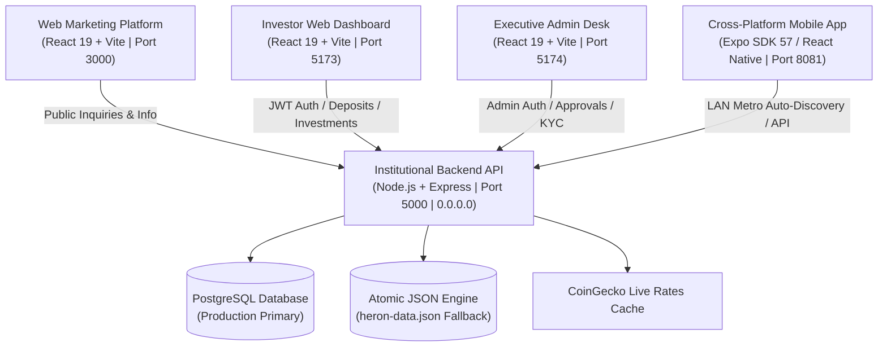

# Heron Capital — Implementation History & Architecture Blueprint

This document tracks the complete chronological timeline of implementations, architectural decisions, system topologies, command execution histories, and operational procedures for the **Heron Capital Institutional Wealth & Crypto Platform**.

---

## [Mandatory Protocol For All Developers & AI Agents]
> 🏛️ **SYSTEM RULE**:
> 1. **ALWAYS CONSULT THIS FILE** to understand the complete architectural structure, data flow, ports, and cross-module dependencies before writing or modifying code.
> 2. **CROSS-REFERENCE WITH `BUGS_AND_ERRORS.md` AND `CHANGELOG.md`** before every implementation to ensure changes are forward-compatible and regression-free.
> 3. **LOG NEW IMPLEMENTATION STEPS** in this file chronologically whenever a new milestone, module, or integration is finalized.

---

## 1. System Ecosystem & Port Topology

The Heron Capital platform is structured into five (5) decoupled, production-grade sub-projects:



| Project Directory | Tech Stack | Port | Purpose / Function |
| :--- | :--- | :--- | :--- |
| **`backend/`** | Node.js, Express, TypeScript, JWT, bcryptjs | `5000` (LAN `0.0.0.0`) | REST API, dual-engine persistence, OTP verification, crypto live pricing, ledger calculations. |
| **`mobile/`** | Expo SDK 57, React Native 0.86.3, React 19.2.3, TypeScript | `8081` (Metro) | iOS & Android mobile application with Heron luxury branding, biometric/OTP flows, and live portfolio tracking. |
| **`web/`** | React 19, Vite 6, Tailwind CSS, Lucide Icons | `3000` | High-conversion institutional public marketing platform. |
| **`dashboard/`** | React 19, Vite 6, Tailwind CSS, Recharts | `5173` | Web portal for verified investors (deposits, yield plans, withdrawals, referrals). |
| **`admin/`** | React 19, Vite 6, Tailwind CSS | `5174` | Executive command center (KYC review, deposit/withdrawal approvals, user ledger, system parameters). |

---

## 2. Chronological Implementation Steps Taken

### Phase 1: Institutional Core Architecture & Backend Engine
1. **TypeScript Express Engine**:
   - Initialized `backend/` with structured separation: `src/controllers/`, `src/routes/`, `src/database/`, `src/middleware/`, `src/services/`.
   - Implemented strict JWT Bearer token authentication with configurable expirations.
   - Built dual-mode persistence (`src/database/index.ts`):
     - Primary: Relational PostgreSQL via `pg` connection pooling.
     - Secondary Fallback: Atomic disk-synchronized JSON database (`heron-data.json`) ensuring uninterrupted local development and testing.
2. **Zero-Balance Financial Security**:
   - Enforced rule that all newly registered user accounts initialize with strictly `$0.00` balances.
   - Capital balances are incremented exclusively upon admin approval of blockchain deposit proofs.
3. **Dual-Phase OTP Engine**:
   - Simulated 6-digit OTP delivery system (`/api/auth/verify-otp`, `/api/wallet/withdraw-otp`) safeguarding user onboarding and withdrawal requests.
4. **Market Rate Caching**:
   - Implemented CoinGecko ticker aggregator with 60-second in-memory cache to supply live BTC, ETH, SOL, and USDT rates without triggering rate limits.

---

### Phase 2: Web Marketing Platform (`web/`)
1. **Institutional Cyber-Luxury Design System**:
   - Dark palette: `#070908` background, `#0d1210` surface, `#1b2620` borders, `#d4af37` gold accents, `#28d17c` emerald highlights.
2. **Page Modules**:
   - `HeroSection`: High-impact headline, live asset metrics, CTA routing to investor signup.
   - `InvestmentStrategies`: Detailed overview of Quantitative Arbitrage, AI High-Frequency Trading, and Sovereign Yield.
   - `PricingPlans`: Interactive tiers (Starter, Core, Sovereign, Quantum) with dynamic yield calculators.
   - `Company & Compliance`: Trust indicators, institutional security certifications, and contact channels.
3. **Execution**:
   - Configured Vite development server on port `3000`.

---

### Phase 3: Investor Web Dashboard (`dashboard/`)
1. **Interactive Portfolio Workspace**:
   - Real-time balance summary (Total Balance, Active Investments, Total Profit, Pending Withdrawals).
   - Deposit flow: Selection of network (BTC, ETH, TRC20, ERC20), dynamic QR codes, copyable wallet addresses, and proof submission.
   - Investment plans manager: Direct capital allocation into yield tiers with daily profit crediting.
   - Withdrawal portal: Form with address verification and OTP authentication.
   - Multi-tier referral system: Referral code generator, commission ledger, and tier progress.
2. **Execution**:
   - Configured Vite development server on port `5173`.

---

### Phase 4: Executive Admin Desk (`admin/`)
1. **Institutional Governance Desk**:
   - `Overview`: Global platform metrics, liquidity pool status, pending queue counters.
   - `Users Ledger`: Searchable table of registered investors, account balances, KYC statuses, and instant freeze/unfreeze controls.
   - `KYC Desk`: Inspection interface for uploaded identity documents with one-click approve/reject actions.
   - `Deposit Approvals`: Pending transaction queue with TXID validation and one-click balance crediting.
   - `Withdrawals Processing`: High-value queue with multi-step authorization.
   - `System Parameters`: Live editor for minimum deposit amounts, platform fees, and referral reward percentages.
   - `Direct Messaging`: Executive broadcast modal to send targeted notifications to all or specific investors.
2. **Execution**:
   - Configured Vite development server on port `5174`.

---

### Phase 5: Cross-Platform Mobile App (`mobile/`)
1. **Expo SDK 57 Upgrade & Architecture**:
   - Configured `mobile/package.json` with Expo SDK 57 (`~57.0.20`), React Native `0.86.3`, and React `19.2.3`.
   - Setup navigation stack with animated tab transitions: Portfolio, Deposit, Invest, Withdraw, Profile.
2. **Luxury Brand Opening Animation (`OpeningSplashScreen.tsx`)**:
   - Custom SVG falcon shield crest with animated golden glow.
   - Animated metallic title: `HERON CAPITAL`.
   - Smooth progress bar with percentage counter and "Enter Platform" instant skip.
3. **LAN Host Auto-Discovery (`mobile/src/services/api.ts`)**:
   - Eliminated hardcoded `localhost` issue.
   - Dynamically parses `Constants.expoConfig?.hostUri` so mobile devices seamlessly talk to the backend over Wi-Fi.
4. **Data Normalization & Error Hardening**:
   - Normalized dictionary deposit addresses into arrays (`Object.values(res.data)`).
   - Unpacked all array responses with fallback `[]` to prevent runtime `.map()` crashes.

---

### Phase 6: Network & Production LAN Synchronization
1. **Express Server LAN Binding**:
   - Modified `backend/src/server.ts` to listen on `'0.0.0.0'` instead of default `localhost`.
   - Verified that physical mobile phones on the same Wi-Fi subnet (`192.168.43.xxx`) can communicate with `http://192.168.43.149:5000/api`.

---

### Phase 7: Repository Version Control & GitHub Sync
1. **Clean Repository State**:
   - Created root `.gitignore` ignoring all build artifacts, caches, and node_modules.
   - Untracked legacy cached files from git index.
2. **Git Commit & Push**:
   - Committed with structured enterprise commit message.
   - Pushed cleanly to GitHub repository `https://github.com/microbase300-cmd/heron.git` on both `main` and `react-web-migration` branches.

---

## 3. Standard Operational Commands

### Launching All Services

```powershell
# 1. Backend API (Port 5000)
cd c:\Users\ADMIN\OneDrive\Documents\heron\backend
npm run dev

# 2. Marketing Web Platform (Port 3000)
cd c:\Users\ADMIN\OneDrive\Documents\heron\web
npm run dev

# 3. Investor Web Dashboard (Port 5173)
cd c:\Users\ADMIN\OneDrive\Documents\heron\dashboard
npm run dev

# 4. Executive Admin Portal (Port 5174)
cd c:\Users\ADMIN\OneDrive\Documents\heron\admin
npm run dev

# 5. Mobile App via Expo Metro (Port 8081)
cd c:\Users\ADMIN\OneDrive\Documents\heron\mobile
npx expo start -c
```

### Quick Verification & Quality Assurance Suite

```powershell
# Verify Backend TypeScript Compilation
cd backend && npm run build

# Verify Mobile TypeScript Compilation
cd mobile && npx tsc --noEmit

# Verify Web, Dashboard, Admin Builds
cd web && npm run build
cd dashboard && npm run build
cd admin && npm run build
```

---

## 4. Mandatory Checklist For Any Future Modifications

Before executing any new command, modifying code, or pushing updates, verify:

1. [ ] **Read `CHANGELOG.md`**: Understand the current release state and planned items.
2. [ ] **Read `BUGS_AND_ERRORS.md`**: Confirm you are not reintroducing previously solved errors (e.g. `localhost` in mobile, `.map()` on dictionary objects, wrong Expo SDK versions, hardcoded positive balances).
3. [ ] **Read `IMPLEMENTATION_HISTORY.md`**: Ensure changes align with the decoupled 5-module architecture and port topology.
4. [ ] **Run Static Typechecks & Builds**: Always execute `npx tsc --noEmit` on `mobile/` and `npm run build` on `backend/` after edits.
5. [ ] **Update All 3 Files**: Log changes in `CHANGELOG.md`, any encountered issues in `BUGS_AND_ERRORS.md`, and new architectural steps in `IMPLEMENTATION_HISTORY.md`.
