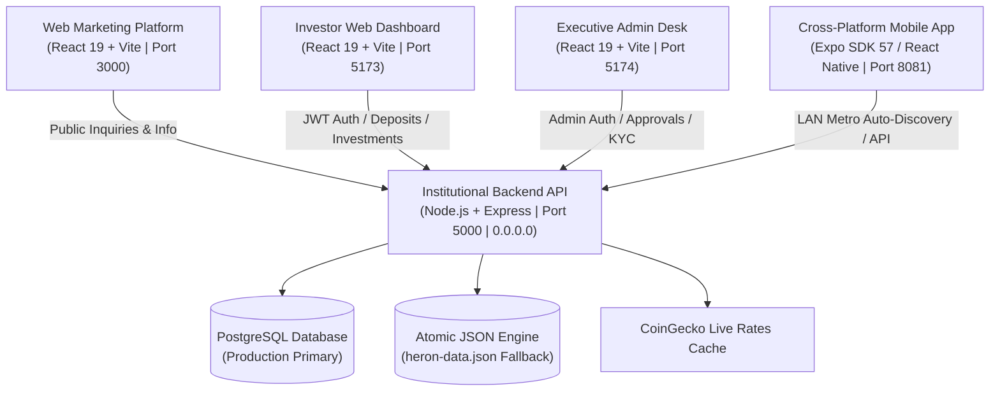

# Heron Capital — Implementation History & Architecture Blueprint

This document tracks the complete chronological timeline of implementations, architectural decisions, system topologies, command execution histories, and operational procedures for the **Heron Capital Institutional Wealth & Crypto Platform**.

---

## [Mandatory Protocol For All Developers & AI Agents]
> 🏛️ **SYSTEM RULE**:
> 1. **ALWAYS CONSULT THIS FILE** to understand the complete architectural structure, data flow, ports, and cross-module dependencies before writing or modifying code.
> 2. **CROSS-REFERENCE WITH `BUGS_AND_ERRORS.md` AND `CHANGELOG.md`** before every implementation to ensure changes are forward-compatible and regression-free.
> 3. **LOG NEW IMPLEMENTATION STEPS** in this file chronologically whenever a new milestone, module, or integration is finalized.

---

## 1. System Ecosystem & Port Topology

The Heron Capital platform is structured into five (5) decoupled, production-grade sub-projects:



| Project Directory | Tech Stack | Port | Purpose / Function |
| :--- | :--- | :--- | :--- |
| **`backend/`** | Node.js, Express, TypeScript, JWT, bcryptjs | `5000` (LAN `0.0.0.0`) | REST API, dual-engine persistence, OTP verification, crypto live pricing, ledger calculations. |
| **`mobile/`** | Expo SDK 57, React Native 0.86.3, React 19.2.3, TypeScript | `8081` (Metro) | iOS & Android mobile application with Heron luxury branding, biometric/OTP flows, and live portfolio tracking. |
| **`web/`** | React 19, Vite 6, Tailwind CSS, Lucide Icons | `3000` | High-conversion institutional public marketing platform. |
| **`dashboard/`** | React 19, Vite 6, Tailwind CSS, Recharts | `5173` | Web portal for verified investors (deposits, yield plans, withdrawals, referrals). |
| **`admin/`** | React 19, Vite 6, Tailwind CSS | `5174` | Executive command center (KYC review, deposit/withdrawal approvals, user ledger, system parameters). |

---

## 2. Chronological Implementation Steps Taken

### Phase 1: Institutional Core Architecture & Backend Engine
1. **TypeScript Express Engine**:
   - Initialized `backend/` with structured separation: `src/controllers/`, `src/routes/`, `src/database/`, `src/middleware/`, `src/services/`.
   - Implemented strict JWT Bearer token authentication with configurable expirations.
   - Built dual-mode persistence (`src/database/index.ts`):
     - Primary: Relational PostgreSQL via `pg` connection pooling.
     - Secondary Fallback: Atomic disk-synchronized JSON database (`heron-data.json`) ensuring uninterrupted local development and testing.
2. **Zero-Balance Financial Security**:
   - Enforced rule that all newly registered user accounts initialize with strictly `$0.00` balances.
   - Capital balances are incremented exclusively upon admin approval of blockchain deposit proofs.
3. **Dual-Phase OTP Engine**:
   - Simulated 6-digit OTP delivery system (`/api/auth/verify-otp`, `/api/wallet/withdraw-otp`) safeguarding user onboarding and withdrawal requests.
4. **Market Rate Caching**:
   - Implemented CoinGecko ticker aggregator with 60-second in-memory cache to supply live BTC, ETH, SOL, and USDT rates without triggering rate limits.

---

### Phase 2: Web Marketing Platform (`web/`)
1. **Institutional Cyber-Luxury Design System**:
   - Dark palette: `#070908` background, `#0d1210` surface, `#1b2620` borders, `#d4af37` gold accents, `#28d17c` emerald highlights.
2. **Page Modules**:
   - `HeroSection`: High-impact headline, live asset metrics, CTA routing to investor signup.
   - `InvestmentStrategies`: Detailed overview of Quantitative Arbitrage, AI High-Frequency Trading, and Sovereign Yield.
   - `PricingPlans`: Interactive tiers (Starter, Core, Sovereign, Quantum) with dynamic yield calculators.
   - `Company & Compliance`: Trust indicators, institutional security certifications, and contact channels.
3. **Execution**:
   - Configured Vite development server on port `3000`.

---

### Phase 3: Investor Web Dashboard (`dashboard/`)
1. **Interactive Portfolio Workspace**:
   - Real-time balance summary (Total Balance, Active Investments, Total Profit, Pending Withdrawals).
   - Deposit flow: Selection of network (BTC, ETH, TRC20, ERC20), dynamic QR codes, copyable wallet addresses, and proof submission.
   - Investment plans manager: Direct capital allocation into yield tiers with daily profit crediting.
   - Withdrawal portal: Form with address verification and OTP authentication.
   - Multi-tier referral system: Referral code generator, commission ledger, and tier progress.
2. **Execution**:
   - Configured Vite development server on port `5173`.

---

### Phase 4: Executive Admin Desk (`admin/`)
1. **Institutional Governance Desk**:
   - `Overview`: Global platform metrics, liquidity pool status, pending queue counters.
   - `Users Ledger`: Searchable table of registered investors, account balances, KYC statuses, and instant freeze/unfreeze controls.
   - `KYC Desk`: Inspection interface for uploaded identity documents with one-click approve/reject actions.
   - `Deposit Approvals`: Pending transaction queue with TXID validation and one-click balance crediting.
   - `Withdrawals Processing`: High-value queue with multi-step authorization.
   - `System Parameters`: Live editor for minimum deposit amounts, platform fees, and referral reward percentages.
   - `Direct Messaging`: Executive broadcast modal to send targeted notifications to all or specific investors.
2. **Execution**:
   - Configured Vite development server on port `5174`.

---

### Phase 5: Cross-Platform Mobile App (`mobile/`)
1. **Expo SDK 57 Upgrade & Architecture**:
   - Configured `mobile/package.json` with Expo SDK 57 (`~57.0.20`), React Native `0.86.3`, and React `19.2.3`.
   - Setup navigation stack with animated tab transitions: Portfolio, Deposit, Invest, Withdraw, Profile.
2. **Luxury Brand Opening Animation (`OpeningSplashScreen.tsx`)**:
   - Custom SVG falcon shield crest with animated golden glow.
   - Animated metallic title: `HERON CAPITAL`.
   - Smooth progress bar with percentage counter and "Enter Platform" instant skip.
3. **LAN Host Auto-Discovery (`mobile/src/services/api.ts`)**:
   - Eliminated hardcoded `localhost` issue.
   - Dynamically parses `Constants.expoConfig?.hostUri` so mobile devices seamlessly talk to the backend over Wi-Fi.
4. **Data Normalization & Error Hardening**:
   - Normalized dictionary deposit addresses into arrays (`Object.values(res.data)`).
   - Unpacked all array responses with fallback `[]` to prevent runtime `.map()` crashes.

---

### Phase 6: Network & Production LAN Synchronization
1. **Express Server LAN Binding**:
   - Modified `backend/src/server.ts` to listen on `'0.0.0.0'` instead of default `localhost`.
   - Verified that physical mobile phones on the same Wi-Fi subnet (`192.168.43.xxx`) can communicate with `http://192.168.43.149:5000/api`.

---

### Phase 7: Repository Version Control & GitHub Sync
1. **Clean Repository State**:
   - Created root `.gitignore` ignoring all build artifacts, caches, and node_modules.
   - Untracked legacy cached files from git index.
2. **Git Commit & Push**:
   - Committed with structured enterprise commit message.
   - Pushed cleanly to GitHub repository `https://github.com/microbase300-cmd/heron.git` on both `main` and `react-web-migration` branches.

---

### Phase 8: Production Polish, Demo Elimination & Staging Verification
1. **Public-Facing Cleanliness**:
   - Removed all visible "demo" references, one-click demo login buttons, and default credentials reminders across Web Dashboard, Admin Desk, and Mobile App.
   - Standardized security verification UI: Replaced "DEV OTP CODE" labels with institutional "🛡️ Security Passcode" badges.
2. **Dedicated Test Access Architecture**:
   - Created [`TESTING_CREDENTIALS.md`](./TESTING_CREDENTIALS.md) cataloging executive and investor test profiles with dedicated balances and roles.
3. **Multi-Project Build & Typecheck Standardization**:
   - Standardized package names: `heron-backend`, `heron-dashboard`, `heron-web`, `heron-admin`.
   - Verified 100% clean typecheck and production builds across all 5 sub-projects.

---

### Phase 9: Administrative Communications & Recipient Picker Upgrade
1. **Interactive Investor Selection Desk**:
   - Replaced fragile native dropdown in `NotificationsDeskView.tsx` with a multi-mode selection system (Interactive Cards, Styled Dropdown, and Manual Entry).
   - Added live search filter and selected recipient confirmation badge.
   - Normalized API array handling in `adminApi.getUsers()` and `adminApi.getNotifications()`.

---

### Phase 10: High-Priority Pop-Up Alerts & Executive Message Box Modals
1. **Automated Priority Pop-Up Engine**:
   - Built automatic pop-up modal interceptors across Web Dashboard (`NotificationCenter.tsx`) and Mobile App (`mobile/App.tsx`) that trigger on receipt of unread `alert`, `warning`, or `success` dispatches.
   - Integrated session deduplication via `seenPopupsRef` / `seenMobilePopupsRef` to guarantee single-fire behavior per notification without polling re-triggers.
   - Implemented "Acknowledge & Confirm" action that sends `api.markNotificationAsRead(id)` to update backend state.
2. **Interactive Executive Message Box Inspector**:
   - Configured all notification items across Web and Mobile with click-to-open handlers.
   - Designed institutional Message Box modal detailing full dispatch headline, multi-paragraph message body, verified sender authority, category badges, and cryptographic audit timestamp.
   - Integrated automatic read-receipt synchronization on click.

---

### Phase 11: Real-Time Settlement Confirmations & Pop-Up Screen Centering
1. **Settlement & Liquidity Confirmation Dispatches**:
   - Wired real-time `success` and `alert` notification generation for deposit approvals, deposit rejections, withdrawal disbursements, and withdrawal refunds in `backend/src/routes/admin.ts`.
   - Added real-time notification dispatch on manual administrative balance adjustments.
   - Accelerated notification polling interval to 10 seconds for real-time responsiveness.
2. **Modal Screen-Centering Architecture**:
   - Built dedicated `modalOverlayCenter` (`justifyContent: 'center'`, `alignItems: 'center'`, `backgroundColor: 'rgba(0,0,0,0.88)'`) in `mobile/App.tsx`, replacing drawer-style bottom alignment with center positioning.
   - Refined mobile card styles (`priorityPopUpCard` and `msgBoxCard`) with `alignSelf: 'center'` and constrained max-widths.
   - Elevated Web Dashboard modal backdrop to `z-[99999]` with `mx-auto my-auto` centering.

---

### Phase 12: Plan Deployment Architecture & Navigation Hardening
1. **Deterministic Plan Tier Fallbacks & State Machine**:
   - Exported `DEFAULT_PLANS` in `dashboard/src/types/index.ts` encompassing all 4 institutional tiers (`amateur`, `standard`, `premium`, `retirement`).
   - Initialized `plans` in `dashboard/src/App.tsx` with `DEFAULT_PLANS` to eliminate empty-state render races.
   - Normalized `api.getPlans()` in `dashboard/src/services/api.ts` with array/envelope adapters and fallback safeguards.
   - Integrated `api.getPlans()` into `refreshData()` in `dashboard/src/App.tsx` for real-time parameter sync.
2. **Defensive Component Rendering in `NewInvestmentView.tsx`**:
   - Upgraded `NewInvestmentView.tsx` with `effectivePlans = (plans && plans.length > 0) ? plans : DEFAULT_PLANS` and safe fallback variables (`planName`, `planDuration`, `planRate`, `planReferralRate`).
   - Prevented runtime `TypeError` crashes when accessing plan attributes during initial render cycles.
   - Verified seamless plan switching, capital range validation, and automatic transition to `mandates` view upon investment creation.
3. **Backend Configuration Persistence**:
   - Added automated initialization of `schema.planConfigs` in `backend/src/services/db.ts` migration and getter handlers.

---

### Phase 13: Null Max JSON Serialization Guard & Plan Limit Hardening
1. **JSON Null Serialization Defense**:
   - Implemented `formatPlanMax()`, `formatPlanMin()`, and `isUncapped()` in `NewInvestmentView.tsx` to handle `null`, `undefined`, `Infinity`, and large bounds without calling `.toLocaleString()` on non-numbers.
   - Normalized `getPlans()` across `dashboard/src/services/api.ts` and `mobile/src/services/api.ts` restoring `Infinity` from JSON `null` values.
   - Fixed backend plan limit validation in `backend/src/routes/invest.ts`, allowing execution for uncapped tiers.
   - Protected plan limit displays in `mobile/App.tsx` and `admin/src/components/PlanConfigView.tsx`.

---

### Phase 14: Institutional Terminology Standardization (Mandate ➔ Investment)
1. **Dashboard UI Refactoring (`dashboard/`)**:
   - Replaced all user-facing labels from "Mandate" to "Investment": "Active Investments", "New Investment", "Investment Tier", "Investment Locks", and "Open a sovereign digital asset investment account".
   - Preserved internal navigation routing and tab mappings while updating tab titles and mobile bottom navigation bars.
2. **Public Platform & HTML Migration (`web/`, `index.html`, `pricing.html`, `strategies.html`, `contact.html`, `company.html`, `assets/js/main.js`)**:
   - Standardized plan names to "Amateur Investment", "Standard Investment", and "Premium Investment".
   - Updated copy across strategy, pricing, contact, company, yield simulation, and legal disclosures ("Matched Investment Tier", "Invest with $... ↗", "Dedicated Private Investment Director", "Investment Agreements").
3. **Admin Operations & Protocol Modernization (`admin/`)**:
   - Standardized `AdminSidebar.tsx` to "Escrow Investments", `EscrowMandatesView.tsx` to "Smart Escrow & Compounding Investments" / "Active Escrow Contracts" / "Matured & Settled Investments", and `PlanConfigView.tsx` to "Configure Investment Plan".
4. **Mobile Application Modernization (`mobile/`)**:
   - Standardized bottom nav tab to "Investments", header cards to "Institutional Yield Investments", deploy modals to "Deploy Capital Investment" / "Select Investment Tier", and alerts to "Investment Deployed".
5. **Backend Data & Route Contract Modernization (`backend/`)**:
   - Added `activeInvestmentsCount` in `AdminMetrics` and `db.getAdminMetrics()` with backward-compatible alias.

---

### Phase 15: Admin Deposit Wallets Fix, Manual Investment Disbursement & Breach Cancellation Suite
1. **Admin Portal Deposit Wallets Normalization**:
   - Resolved blank page on the "Deposit Wallets" tab in `admin/src/components/DepositWalletsView.tsx`.
   - Added robust dictionary-to-array payload normalization in `adminApi.getWallets()` so `Record<string, DepositAddressConfig>` maps seamlessly into structured config cards.
   - Enhanced UI with instant clipboard copying, live address validation, network/asset editing, active/disabled toggling, and visual feedback toasts.
2. **Admin Manual Disbursement Architecture for Matured Investments**:
   - Refactored `backend/src/services/investmentEngine.ts` to transition expired investments from `active` to `matured` status instead of executing automated silent balance crediting.
   - Built `POST /api/admin/investments/:id/disburse` in `backend/src/routes/admin.ts` to settle payouts (`Principal + Yield`), credit the investor's balance, create cryptographic transaction records (`0x...`), and dispatch high-priority `'success'` celebration pop-up alerts.
   - Upgraded `admin/src/components/EscrowMandatesView.tsx` with dedicated "Matured Queue (Action Required)" badges and one-click "Disburse Payout" controls.
3. **Institutional Breach of Rules Cancellation Suite**:
   - Built `POST /api/admin/investments/:id/cancel` in `backend/src/routes/admin.ts` allowing administrators to terminate contracts for rule infractions (Multi-account/Sybil, AML discrepancies, high-frequency arbitrage, terms violation).
   - Designed a comprehensive Cancellation Modal in `EscrowMandatesView.tsx` with selectable rule breach categories, custom notice inputs, and optional principal refund toggling.
   - Wired high-priority `'alert'` notification generation that immediately triggers the centered warning modal on the investor's dashboard with the breach details.
4. **Investor Web Dashboard & Mobile UI Modernization**:
   - Updated `dashboard/src/components/MandatesView.tsx` with filter tabs (`All`, `Active`, `Matured`, `Settled`, `Cancelled`), glowing golden `Matured (Pending Release)` badges, and breach notice banners.
   - Updated `mobile/App.tsx` and `mobile/src/types/index.ts` with distinct pill badges for `matured` and `cancelled` contracts.

---

### Phase 16: Dedicated Investor Portfolios Management Hub & Macro Escrow Separation
1. **Dedicated Investor Portfolios Command Center (`admin/src/components/InvestorPortfoliosView.tsx`)**:
   - Designed an institutional two-pane layout separating the user directory from their individual investment dossiers.
   - **Left Column Directory**: Real-time searchable investor index with categorized status pills (`All`, `Active Investors`, `Matured Queue`, `Funded`, `Unfunded`), showing active contract count, total active capital, and liquid wallet balances.
   - **Right Column Portfolio Hub**:
     - Selected investor executive profile header with direct Balance Top-Up / Adjustment modal (`adminApi.adjustUserBalance`).
     - Key financial KPIs: Available Liquid Balance, Active Capital Locked in Escrow, Lifetime Accrued Yield, and Disbursed Payouts.
     - Granular investment plan contracts deck with filter chips (`All`, `Matured Queue`, `Active in Escrow`, `Settled`, `Cancelled`).
     - Full operational action controls per contract: **Disburse Matured Payout** (with real-time state sync, transaction hash logging, and celebration notification dispatch), **Force Early Settlement**, and **Cancel Contract (Rule Breach)**.
     - Rule Breach Modal featuring preset institutional violation templates (Multi-account/Sybil activity, AML discrepancies, ToS arbitrage violations, Regulatory disqualification), custom audit notes, and configurable Principal Refund toggle.
2. **Macro Escrow Ledger Streamlining (`admin/src/components/EscrowMandatesView.tsx`)**:
   - Removed destructive contract actions (early maturity / breach cancellation) from the mixed macro view to prevent accidental modifications across mixed investor accounts.
   - Re-architected as a high-level macro platform escrow audit ledger with top-level aggregate KPIs: Active Locked in Escrow, Matured Settlement Queue, and Lifetime Disbursed Payouts.
   - Added interactive deep-linking CTA (`"Manage in Investor Portfolio ↗"`) on each contract card and top navigation, allowing administrators to jump straight to the investor's dedicated management hub.
3. **Cross-Tab Deep Linking (`admin/src/App.tsx` & `admin/src/components/UserManagementView.tsx`)**:
   - Registered `investor_portfolios` in `AdminTab` navigation with `UserCheck` icon.
   - Added quick-access "Plans ↗" button in the User Directory table (`UserManagementView.tsx`), immediately switching to `investor_portfolios` with the selected user loaded.

---

### Phase 17: Admin Deposit Wallets Smart Network Presets & Mobile Ecosystem Harmony
1. **Admin Portal Deposit Wallets Smart Network Dropdown (`admin/src/components/DepositWalletsView.tsx`)**:
   - Upgraded the Network Label field from a plain text input to a rich, asset-aware `<select>` dropdown.
   - Categorized network presets dynamically based on the wallet's crypto asset (e.g. `USDT` -> `Tron (TRC-20)`, `Ethereum (ERC-20)`, `BNB Smart Chain (BEP-20)`, `Solana SPL`, `Polygon (PoS)`, `Arbitrum One`, `Optimism`, `Base`, `Avalanche C-Chain`, `TON`; `BTC` -> `Bitcoin Native SegWit`, `Legacy`, `Taproot`, `Lightning`, `BEP-20`; `ETH` -> `Ethereum Mainnet`, `Arbitrum One`, `Optimism`, `Base`, `Polygon`, `BEP-20`; `SOL` -> `Solana SPL`, `Solana Native`).
   - Added an intuitive `✎ Custom / Other Network Label...` option with an automatic inline text input allowing administrators to enter custom network labels while maintaining 1-click preset convenience.
2. **Mobile App Inbound Deposit Treasury Card (`mobile/App.tsx`)**:
   - Enhanced the mobile Deposit Modal to dynamically resolve and display the official receiving treasury address from `depositAddresses` corresponding to the chosen asset.
   - Built a 1-tap `Copy Receiving Address` button with live visual feedback, network verification tag, optional routing memo indicator, and enterprise security instructions matching the web dashboard experience.
3. **Mobile App Investment Status Harmonization & Compliance Alerts (`mobile/App.tsx`)**:
   - Added horizontal status filter chips (`All`, `Active`, `Matured`, `Settled`, `Cancelled`) in the mobile Investments tab.
   - Integrated golden glowing `MATURED (QUEUED)` status cards and informative notices for contracts awaiting administrative payout disbursement.
   - Integrated rose `CANCELLED` compliance notice cards displaying the exact breach reason (`cancellationReason`).
   - Integrated live countdown timers and progressive yield indicators for active timelocked contracts.

---

### Phase 18: Ecosystem-Wide True-Weight Typography & Faux-Bold Smudge Elimination
1. **Root Cause Analysis (RCA)**:
   - Diagnosed that `Instrument Serif` only supplies weight 400 (`wght@400`). When components like `Navbar.tsx` (`<h1>Portfolio Intelligence</h1>`), `OverviewView.tsx`, and `MandatesView.tsx` applied `font-bold` (`700`/`800`), browsers applied artificial faux-bold stroke expansions, smudging and distorting glyph outlines.
   - In addition, Windows/Chromium rendering of heavy `backdrop-filter: blur(...)` containers without GPU compositing layers bled into typography rendering.
2. **Google Fonts & Variable Font Coverage**:
   - Upgraded font imports across `dashboard/index.html`, `web/index.html`, and `admin/index.html` to load full font weight ranges for `Cinzel` (500..900), `Playfair Display` (400..900), `Plus Jakarta Sans` (400..800), `Inter` (300..800), and `JetBrains Mono` (400..700).
3. **Tailwind & CSS Typography Architecture**:
   - Configured `dashboard/tailwind.config.js` and `admin/tailwind.config.js` with structured font stacks: `serif: ['"Playfair Display"', 'Cinzel', 'Georgia', 'serif']` and `sans: ['"Plus Jakarta Sans"', 'Inter', ...]`.
   - Defined unified CSS variables in `web/src/index.css` (`--font-serif`, `--font-sans`, `--font-mono`) and replaced unweighted declarations with true-weight variable references.
   - Added GPU layer promotion (`will-change: transform`, `transform: translateZ(0)`) and container stacking isolation (`isolation: isolate`) in `dashboard/src/index.css`.
4. **Mobile Typography Stability (`mobile/App.tsx`)**:
   - Replaced legacy font strings (`'Courier'`) with platform-safe monospaces (`Platform.OS === 'ios' ? 'Menlo' : 'monospace'`) and confirmed robust typography rendering without clipping across all screens.
5. **Universal Build & Typecheck Verification**:
   - Executed full compilation suite across all 5 sub-projects: `dashboard` (0 errors), `admin` (0 errors), `web` (0 errors), `backend` (0 errors), `mobile` (0 errors).

---

### Phase 19: Dashboard & Admin Transition to High-Tech Geometric Sans-Serif
1. **Design Philosophy & Visual Alignment**:
   - Transitioned all real-time financial dashboards, metric cards, navigation elements, action modals, and admin operational desks from serif to high-tech geometric sans-serif (`Plus Jakarta Sans` / `Inter`).
   - Replaced narrow, condensed serif headings ("Portfolio Intelligence", "Active Investments", "Deploy Institutional Capital", "Institutional Affiliate Network", "Cryptographic Audit Ledger", "Disburse Liquidity", etc.) with ultra-clean `font-sans font-bold tracking-tight text-white` headers.
2. **Dashboard UI Refactoring**:
   - `Navbar.tsx`: Modernized main header and breadcrumbs.
   - `Sidebar.tsx`: Modernized brand title, subtitle, and Available Liquidity balance widget.
   - `OverviewView.tsx`: Upgraded Net Asset Value, 4 key performance indicator cards, Programmatic Return Horizons, and Live Compounding cards.
   - `MandatesView.tsx` & `NewInvestmentView.tsx`: Upgraded plan cards, yield percentages, investment inputs, duration schedules, and presets.
   - `DepositModal.tsx` & `WithdrawModal.tsx`: Modernized headers, inputs, and fee previews.
   - `AuthModal.tsx`: Modernized logo, titles, and verification OTP previews.
   - `ReferralsView.tsx`: Modernized tier commission architecture and affiliate statistics.
   - `LedgerView.tsx`: Modernized audit ledger header and amount rows.
   - `NotificationCenter.tsx`: Modernized high-priority dispatch and message box modals.
   - `AssetAllocationChart.tsx`: Fixed tooltip overlap and z-index positioning (`wrapperStyle={{ zIndex: 100, pointerEvents: 'none' }}`).
3. **Admin Portal Refactoring**:
   - `AdminNavbar.tsx`: Modernized executive clearance header and user profile name.
   - `AdminLogin.tsx`: Modernized portal headline and login card header.
   - `UserManagementView.tsx`: Upgraded investor directory header, user row names, and balance top-up modal.
   - `TransactionDeskView.tsx`: Upgraded settlement desk header.
   - `PlanConfigView.tsx`: Upgraded tier parameter header, plan cards, and configuration modal.
   - `EscrowMandatesView.tsx`: Upgraded escrow ledger header, KPI cards, and settled audit table.
   - `NotificationsDeskView.tsx`: Upgraded communications desk header.
   - `InvestorPortfoliosView.tsx`: Upgraded investor dossier, 4 metric cards, plan items, and adjustment/cancellation modals.
   - `ExecutiveMetricsView.tsx`: Upgraded institutional liquidity NAV, core stat cards, inflow/outflow ratios, and live Binance ticker header.
   - `DepositWalletsView.tsx`: Upgraded receiving wallets header.
4. **Build & Quality Assurance Suite**:
   - Executed `npm run build` on `dashboard/` (Exit Code 0).
   - Executed `npm run build` on `admin/` (Exit Code 0).
   - Executed `npm run build` on `web/` (Exit Code 0).

---

### Phase 20: Mobile App Full Feature Synchronization & Architecture Parity
1. **100% Terminology Harmonization (`mobile/App.tsx`)**:
   - Retired all legacy "mandate" nomenclature across navigation tab types (`type NavTab = 'overview' | 'investments' | 'liquidity' | 'referrals' | 'ledger'`), active tab routing, and component style definitions (`investmentCard`, `investmentsHeaderBox`, `investmentGrid`, `investmentVal`, `investmentCardMatured`, `investmentCardCancelled`).
2. **Inbound Multi-Asset Deposit Screen Upgrade**:
   - Integrated dynamic receiving treasury address card with real-time asset matching, 1-tap clipboard copy button, routing memo/tag display, and strict network safety notices.
3. **Outbound 2FA Capital Release Screen Upgrade**:
   - Added 1-touch percentage allocation buttons (`25%`, `50%`, `75%`, `MAX`) based on available liquidity.
   - Added Institutional Subsidy notice confirming 100% network gas fee waiver by Heron Capital treasury.
   - Retained 2-Step OTP email verification pipeline with Dev OTP autofill badge for seamless testing.
4. **Investment Deployment Modal & Real-Time Yield Calculator**:
   - Embedded dynamic promissory yield simulation breakdown calculating Principal, Programmatic Yield (+4.5% to +22.5%), Lock Duration (24h to 96h), Expected Net Profit ($), Total Expected Payout ($), and projected maturity timestamps.
   - Added quick allocation preset buttons (`$500`, `$2,500`, `$7,500`, `$15,000`, `MAX`).
   - Added in-line minimum and maximum tier constraint alerts.
5. **Active Timelock Contracts & Algorithmic Yield Velocity**:
   - Added live yield velocity indicator displaying real-time accrued profit (`+$X.XX accrued`) and hourly velocity rate (`+$X.XX/hr`).
   - Integrated Matured Queued notice cards ("✨ 100% Maturity Completed — Queued for executive disbursement") and Cancelled breach reason cards.
6. **4-Tier Partner Affiliate Screen**:
   - Added 1-tap referral code and referral link copying.
   - Added 4-Tier Commission Architecture schedule card (Tier 1: 8.0%, Tier 2: 16.0%, Tier 3: 24.0%, Tier 4: 30.0%).
   - Added downline network directory and commission earnings ledger.
7. **Cryptographic Audit Ledger with Category Filtering**:
   - Added category filter chips (`All`, `Deposits`, `Withdrawals`, `Yield`, `Affiliate`).
   - Added blockchain transaction hash display with 1-tap copy button and formatted amounts (+ for credits, - for debits).
8. **Universal Build & Typecheck Verification**:
   - Executed `npx tsc --noEmit` on `mobile/` (Exit Code 0).
   - Executed `npm run build` on `dashboard/` (Exit Code 0).
   - Executed `npm run build` on `admin/` (Exit Code 0).
   - Executed `npm run build` on `web/` (Exit Code 0).

### Phase 9: Binance Pro Visual Theme, Texture, & 2x UI Transformation (Full Ecosystem)
1. **Design System & Token Standardization**:
   - Defined strict Binance Pro tokens:
     - Gunmetal base: `#181A20`
     - Charcoal surface: `#1E2329`
     - Elevated border: `#2B313A` & `#363D47`
     - Binance Gold/Yellow: `#F0B90B` (Hover `#FCD535`, Dark `#C99400`)
     - High-contrast text: `#EAECEF` (Primary), `#848E9C` (Secondary), `#5E6673` (Tertiary)
     - Financial indicators: `#0ECB81` (Profit green), `#F6465D` (Loss coral red)
2. **Investor Dashboard Refactoring (`dashboard/`)**:
   - Updated `tailwind.config.js` and `index.css` with Binance palette, glass panels, inputs, and `.btn-binance`.
   - Updated root shell in `App.tsx` and all 12 component files: `TickerBar.tsx`, `Sidebar.tsx`, `Navbar.tsx`, `OverviewView.tsx`, `PortfolioYieldChart.tsx`, `AssetAllocationChart.tsx`, `MandatesView.tsx`, `NewInvestmentView.tsx`, `ReferralsView.tsx`, `LedgerView.tsx`, `DepositModal.tsx`, `WithdrawModal.tsx`, `NotificationCenter.tsx`.
3. **Executive Admin Desk Refactoring (`admin/`)**:
   - Updated `tailwind.config.js`, `index.css`, `App.tsx`, and all 9 admin components: `AdminNavbar.tsx`, `AdminSidebar.tsx`, `AdminLogin.tsx`, `ExecutiveMetricsView.tsx`, `DepositWalletsView.tsx`, `InvestorPortfoliosView.tsx`, `EscrowMandatesView.tsx`, `UserManagementView.tsx`, `NotificationsDeskView.tsx`, `TransactionDeskView.tsx`, `PlanConfigView.tsx`.
4. **Marketing Web Platform Refactoring (`web/` & HTML files)**:
   - Updated `web/src/index.css` and root `assets/css/style.css` to Binance Pro dark theme tokens, interactive yield calculator styles, pricing grid, and mobile app dialog styles.
5. **Cross-Platform Mobile App Refactoring (`mobile/App.tsx`)**:
   - Transformed all React Native styles, modals, splash screen, and component definitions to the Binance Pro palette.
6. **Full-Ecosystem Verification**:
   - `dashboard/`: `npx tsc && vite build` (Exit Code 0)
   - `admin/`: `tsc && vite build` (Exit Code 0)
   - `web/`: `tsc -b && vite build` (Exit Code 0)
   - `mobile/`: `npx tsc --noEmit` (Exit Code 0)

### Phase 10: Luxury Web Restoration with Custom Cursor & Elevated Binance Pro Ecosystem
1. **Web App Luxury Theme Restoration (`web/` & `assets/css/style.css`)**:
   - Reverted `web/` to the editorial luxury style: warm paper background (`#f3f0e8`), rich dark ink (`#0b0d0d`), antique gold accents (`#d6a84f`), and classical serif typography (`Playfair Display`, `Instrument Serif`).
   - Retained and elevated Binance Pro dark theme for `dashboard/`, `admin/`, and `mobile/`.
2. **Interactive Lerp Physics Custom Cursor (`web/src/components/CustomCursor.tsx`)**:
   - Implemented 60fps `requestAnimationFrame` lerping cursor tracking the mouse pointer smoothly with zero DOM lag.
   - Configured active hover targeting for all interactive elements (`a`, `button`, `input`, `textarea`, `select`, `.btn`, `.plan-card`, `.price-card`, `.story-card`, `.portrait`, `.ticker`, `.nav-menu-toggle`, `.calc-preset-btn`).
   - Integrated with graceful fallback on mobile touch devices (`(pointer: fine)` detection).
3. **Elevated UI Polish in Dashboard, Admin, and Mobile**:
   - Polished Binance Pro dark surfaces, glowing borders on hover, trading badges, micro-animations, and institutional typography.
4. **Universal Build & Typecheck Verification**:
   - `web/`: `npm run build` (Exit Code 0)
   - `dashboard/`: `npm run build` (Exit Code 0)
   - `admin/`: `npm run build` (Exit Code 0)
   - `mobile/`: `npx tsc --noEmit` (Exit Code 0)
   - `backend/`: `npx tsc --noEmit` (Exit Code 0)

### Phase 11: Custom Luxury Pop-Up Modal System (Mobile App)
1. **Replacement of Plain White OS Alerts (`mobile/App.tsx`)**:
   - Replaced all `Alert.alert` calls across authentication, OTP verification, deposit submission, withdrawal authorization, investment deployments, and network configurations with a dedicated `CustomAlertModal`.
   - Designed with the Binance Pro dark theme (`#1E2329` card surface, `#2B313A` & `rgba(240,185,11,0.4)` borders, `#F0B90B` button, and glowing icon badges for success, error, warning, and info).
   - Rendered at the root of both unauthenticated and authenticated branches for a seamless and luxury user experience.
2. **Typecheck & Verification**:
   - `mobile/`: `npx tsc --noEmit` (Exit Code 0).

---

## 3. Standard Operational Commands

### Launching All Services

```powershell
# 1. Backend API (Port 5000)
cd c:\Users\ADMIN\OneDrive\Documents\heron\backend
npm run dev

# 2. Marketing Web Platform (Port 3000)
cd c:\Users\ADMIN\OneDrive\Documents\heron\web
npm run dev

# 3. Investor Web Dashboard (Port 5173)
cd c:\Users\ADMIN\OneDrive\Documents\heron\dashboard
npm run dev

# 4. Executive Admin Portal (Port 5174)
cd c:\Users\ADMIN\OneDrive\Documents\heron\admin
npm run dev

# 5. Mobile App via Expo Metro (Port 8081)
cd c:\Users\ADMIN\OneDrive\Documents\heron\mobile
npx expo start -c
```

### Quick Verification & Quality Assurance Suite

```powershell
# Verify Backend TypeScript Compilation
cd backend && npm run build

# Verify Mobile TypeScript Compilation
cd mobile && npx tsc --noEmit

# Verify Web, Dashboard, Admin Builds
cd web && npm run build
cd dashboard && npm run build
cd admin && npm run build
```

---

## 4. Mandatory Checklist For Any Future Modifications

Before executing any new command, modifying code, or pushing updates, verify:

1. [ ] **Read `CHANGELOG.md`**: Understand the current release state and planned items.
2. [ ] **Read `BUGS_AND_ERRORS.md`**: Confirm you are not reintroducing previously solved errors (e.g. `localhost` in mobile, `.map()` on dictionary objects, wrong Expo SDK versions, hardcoded positive balances).
3. [ ] **Read `IMPLEMENTATION_HISTORY.md`**: Ensure changes align with the decoupled 5-module architecture and port topology.
4. [ ] **Run Static Typechecks & Builds**: Always execute `npx tsc --noEmit` on `mobile/` and `npm run build` on `backend/` after edits.
5. [ ] **Update All 3 Files**: Log changes in `CHANGELOG.md`, any encountered issues in `BUGS_AND_ERRORS.md`, and new architectural steps in `IMPLEMENTATION_HISTORY.md`.
